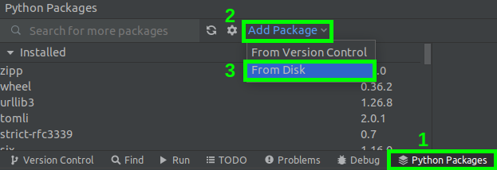
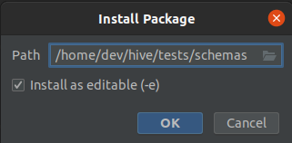

## Introduction

Schemas package is a tool for validating the structure of JSON data. This package is a set of library-based
[jsonschema](https://json-schema.org/) wrappers, allowing you to easily and quickly write schemas that can be used for
 validation, e.g. API response.

## Installation
<details>
<summary>Install with PyCharm</summary>

- With opened project, select tab "Python Packages" at the bottom of window, click "Add Package" and then "From Disk".



- Select 'Schemas' directory, mark "Install as editable" option and click OK.



</details>

<details>
<summary>Install in virtual environment manually</summary>

```bash
cd ~/virtual_environments               # Select location for virtual environment
python3.8 -m venv venv                  # Create virtual environment in current directory
source venv/bin/activate                # Activate it
pip install -e ~/hive/tests/schemas     # Install Schemas
```
</details>

<details>
<summary>Install in your operating system scope (not recommended)</summary>
Enter following command in terminal:

```bash
pip3 install -e ~/hive/tests/schemas
```
</details>

## How to use
### Simple example
```python
from schemas.predefined import *

schema = Array(Int())
schema.validate([0, 1, 2])
```

Above code ensures, that `[0, 1, 2]` is array of ints. Passed validation has no effect, program just continues execution. Validation that fails will throw an exception and notify us about the encountered error.

### Failed validation
When in above example we will change array `[0, 1, 2]` to `[0, 1, 'two']`, then validation will fail with following error:
```text
Failed validating 'type' in schema['items']:
    {'type': 'hive-int'}

On instance[2]:
    'two'
```

The error informs that on the 2nd item of the `instance[2]` the instance does not match the schema. An exception was
thrown, and the program terminated.

### Real world example
Let's imagine, that we received following response from tested method.
```python
response = [
    {
        'id': 0,
        'owner': 'alice',
        'requestid': 1652091374,
        'amount': {
            'amount': '100',
            'precision': 3,
            'nai': '@@000000013'
        },
        'conversion_date': '2022-05-12T22:16:15'
    }
]
```

We can validate such responses with following schema:
```python
get_conversion_requests_schema = Array(
    Map({
        'id': Int(),
        'owner': Str(),
        'requestid': Int(),
        'amount': AssetHbd(),
        'conversion_date': Date(),
    })
)

get_conversion_requests_schema.validate(response)
```

More real world examples:
- [schemas definitions for wallet bridge API](schemas/apis/wallet_bridge_api/response_schemas.py)
- [message format tests for wallet bridge API](https://gitlab.syncad.com/hive/hive/-/tree/develop/tests/api_tests/message_format_tests/wallet_bridge_api_tests)

### Automatic responses validation

TestTools provide support for schemas, to validate all responses automatically. Everytime when you call a method,
response will be validated with corresponding schema. It makes tests shorter and more readable, because there is no
code handling validation (you even don't need to import schemas).

Automatic responses validation can be enabled with an environment variable `TEST_TOOLS_VALIDATE_RESPONSE_SCHEMAS`
set to `TRUE`. Schemas have to be defined in `schemas/package/schemas/` directory. **The schema must have the same
name as the API method being validated.** Missing schema is treated as error.

For example, when you want to test `broadcast_transaction_synchronous` from `wallet_bridge_api`, you have to make it
possible to import your schema with `from schemas.wallet_bridge_api import broadcast_transaction_synchronous`. See
`schemas/package/schemas/wallet_bridge_api` for examples.

Define schema in `schemas/package/schemas/wallet_bridge_api/response_schemas.py`:
```python
# In schemas/package/schemas/wallet_bridge_api/response_schemas.py
broadcast_transaction_synchronous = Map({
    'block_num': Int(),
    'expired': Bool(),
    'id': Id(),
    'trx_num': Int(),
})

# In schemas/package/schemas/wallet_bridge_api/__init__.py
from schemas.wallet_bridge_api.response_schemas import broadcast_transaction_synchronous

# In your_test.py
node.api.wallet_bridge_api.broadcast_transaction_synchronous(transaction)
```

### Predefined schemas
#### Fundamental schemas ([source code](https://gitlab.syncad.com/hive/schemas/-/blob/master/package/schemas/__private/fundamental_schemas.py), [unit tests](https://gitlab.syncad.com/hive/schemas/-/blob/master/tests/test_fundamental_schemas.py))

| Types   | Correct values (in Python)                       | Description                                           |
|---------|--------------------------------------------------|-------------------------------------------------------|
| `Any`   | `True`, `128`, `3.14`, `{}`, `[0, 1, 2]`, `None` | Any value                                             |
| `Bool`  | `True`, `False`                                  |                                                       |
| `Date`  | `'2022-05-12T22:16:15'`                          | Date format used by Hive                              |
| `Float` | `3.14`, `128`                                    |                                                       |
| `Int`   | `1`, `42`, `-100`, `'1'`, `'42'`, `'-100'`       | Int format used by Hive (accept also ints as strings) |
| `Null`  | `None`                                           |                                                       |
| `Str`   | `'string'`                                       |                                                       |


| Containers         | Description                                                                                                                                                                                                 |                                             Docs                                             |
|--------------------|-------------------------------------------------------------------------------------------------------------------------------------------------------------------------------------------------------------|:--------------------------------------------------------------------------------------------:|
| `Array`            | Contains unlimited number of items of types specified as `Array's` parameters. For example `Array(Int())` should be read as "array of ints" e.g. `[0, 1, 2, 3]`.                                            |         [📖](http://json-schema.org/understanding-json-schema/reference/array.html)          |
| `ArrayStrict`      | Contains items in order specified in `ArrayStrict's` parameters. For example `ArrayStrict(Int(), Str())` should be read as "2-element array with 0-th element of type `Int` and 1-st element of type `Str`. | [📖](http://json-schema.org/understanding-json-schema/reference/array.html#tuple-validation) |
| `Map`              | Python's dicts. Contains key-value pairs. For example `Map({'number': Int(), 'name': Str())}` matches `{'number': 0, 'name': 'John'}`.                                                                      |         [📖](http://json-schema.org/understanding-json-schema/reference/object.html)         |


| Quantifiers          | Description                                                                                                                                                                                                              |                                            Docs                                            |
|----------------------|--------------------------------------------------------------------------------------------------------------------------------------------------------------------------------------------------------------------------|:------------------------------------------------------------------------------------------:|
| `AllOf`              | The instance must be valid for all given types. For example integer which is multiple of 3 and 5 at the same time (e.g. 15 or 30), can be expressed as `AllOf(Int(mulipleOf=3), Int(mulipleOf=5))`.                      |   [📖](http://json-schema.org/understanding-json-schema/reference/combining.html#allof)    |
| `AnyOf`              | The instance must be valid for any (one or more) of the given types. For example optional `Bool` can be expressed as `AnyOf(Bool(), Null())`.                                                                            |   [📖](http://json-schema.org/understanding-json-schema/reference/combining.html#anyof)    |
| `OneOf`              | The instance must be valid for exactly one of the given types. For example integer which is multiple of 3 or 5, but not both of them (e.g. 6 or 10), can be expresses as `OneOf(Int(multipleOf=3), Int(multipleOf=5))`.  |   [📖](http://json-schema.org/understanding-json-schema/reference/combining.html#oneof)    |

#### Custom schemas used in Hive ([source code](https://gitlab.syncad.com/hive/schemas/-/blob/master/package/schemas/__private/custom_schemas.py), [unit tests](https://gitlab.syncad.com/hive/schemas/-/blob/master/tests/test_custom_schemas.py))


Schema creation becomes much easier when we use a custom schema. You can use the already defined ones or create your own.
When you notice that any part of the response repeats over and over, you can save it as custom schema. The following are
the real API responses that can be checked with the custom schema.

<table>
<tr>
</tr>

<th colspan="3" style="font-weight:normal">Asset is a representation of the Hive currency. In Hive we have three different types of assets, so
we have three custom schemas ready to use:</th>

<tr>
<th>AssetHbd</th>
<th>AssetHive</th>
<th>AssetVests</th>
<tr>
<td>

```python
{
    "amount": "0",
    "precision": 3,
    "nai": "@@000000013"
}
```

</td>
<td>

```python
{
    "amount": "0",
    "precision": 3,
    "nai": "@@000000021"
}
```

</td>
<td>

```python
{
    "amount": "0",
    "precision": 6,
    "nai": "@@000000037"
}
```

</td>
</tr>
</table>

**Authority** - account has multiple authority and keys to manager different permissions on the platform. Authorization
can be used with different public keys and accounts
```python
{
    "weight_threshold": 1,
    "account_auths": [
        ["threespeak", 1],
        ["vimm.app", 1]
    ],
    "key_auths": [
        ["STM5RLQ1Jh8Kf56go3xpzoodg4vRsgCeWhANXoEXrYH7bLEwSVyjh", 1]
    ]
}
```
**TransactionId** - unique transaction identifier
```python
"000000048079b3a4f7c618719f93d42748d06b1d"
```

**PublicKey** - takes values available for public keys
```python
"STM4uD3dfLvbz7Tkd7of4K9VYGnkgrY5BHSQt52vE52CBL5qBfKHN"

"TST5RrTRNDhhrMaA24SzSeE5AvmUcutb1q1VZp1imnT8p871s3UjN"
```

**Manabar** - represents the value of the resources: voting power, downvote power and resource credits.
Users automatically spend resources depending on the transactions performed. The amount of mana usage depends on the
execution time, state size, transaction size. That is regenerated from 0 to 100% of max linearly over 5 days.

```python
{
    "current_mana": "1481483243064851",
    "last_update_time": 1652183439
}
```

**Price** - express price of first currency (`base`) in second currency (`quote`). For example, when you have to pay 1 HBD for 2 Hive then, you can express it as price with `base = 1 HBD` and `quote = 2 HIVE`.

```python
{
    "base": {
        "amount": "1",
        'precision': 3,
        'nai': '@@000000013'
    },
    "quote": {
        "amount": '1',
        "precision": 3,
        "nai": "@@000000021"
    }
}
```

**Proposal** - user suggestion in hive development. The proposal may be an idea for improving the hive performance or an
additional feature, advertisement. The suggestion is voted on by the community. When it wins, it is implemented.
Proposal stores information about a given suggestion.
```python
{
    'id': 0,
    'proposal_id': 0,
    'creator': 'account-0',
    'receiver': 'account-0',
    'start_date': '2022-05-10T14:24:32',
    'end_date': '2022-06-14T14:24:32',
    'daily_pay': {
        'amount': '0',
        'precision': 3,
        'nai': '@@000000013'
    },
    'subject': 'subject-0',
    'permlink': 'permlink',
    'total_votes': 0,
    'status': 'inactive'
}
```

**HardforkVersion**
```python
'1.26.0'
```
